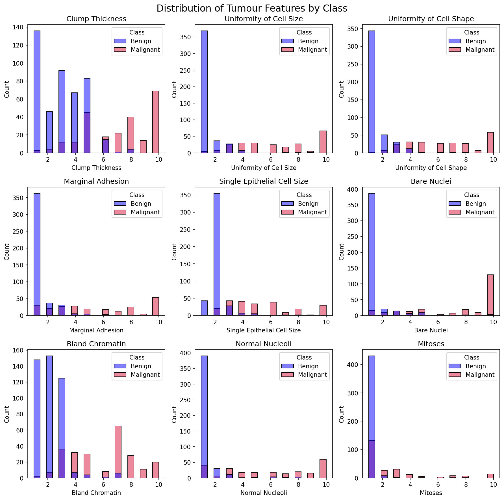
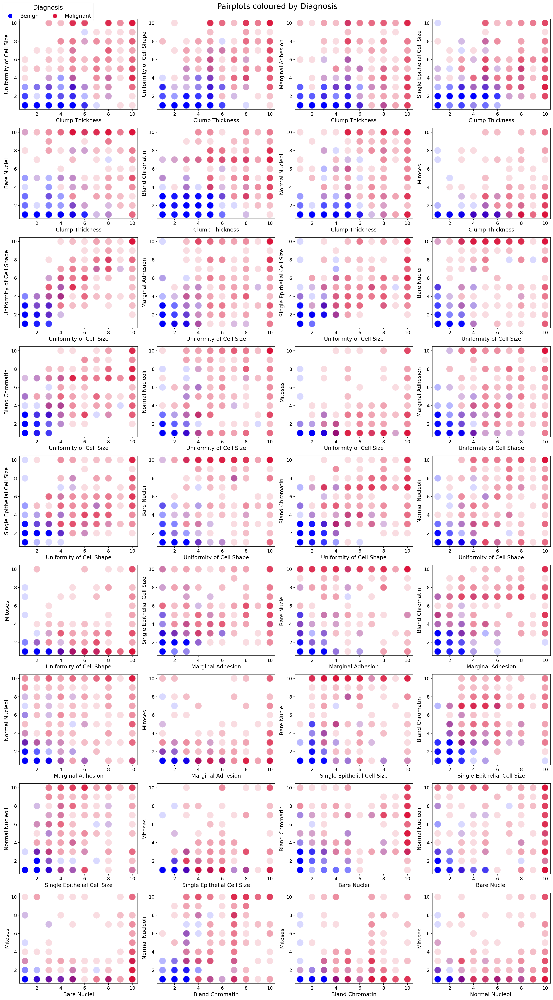
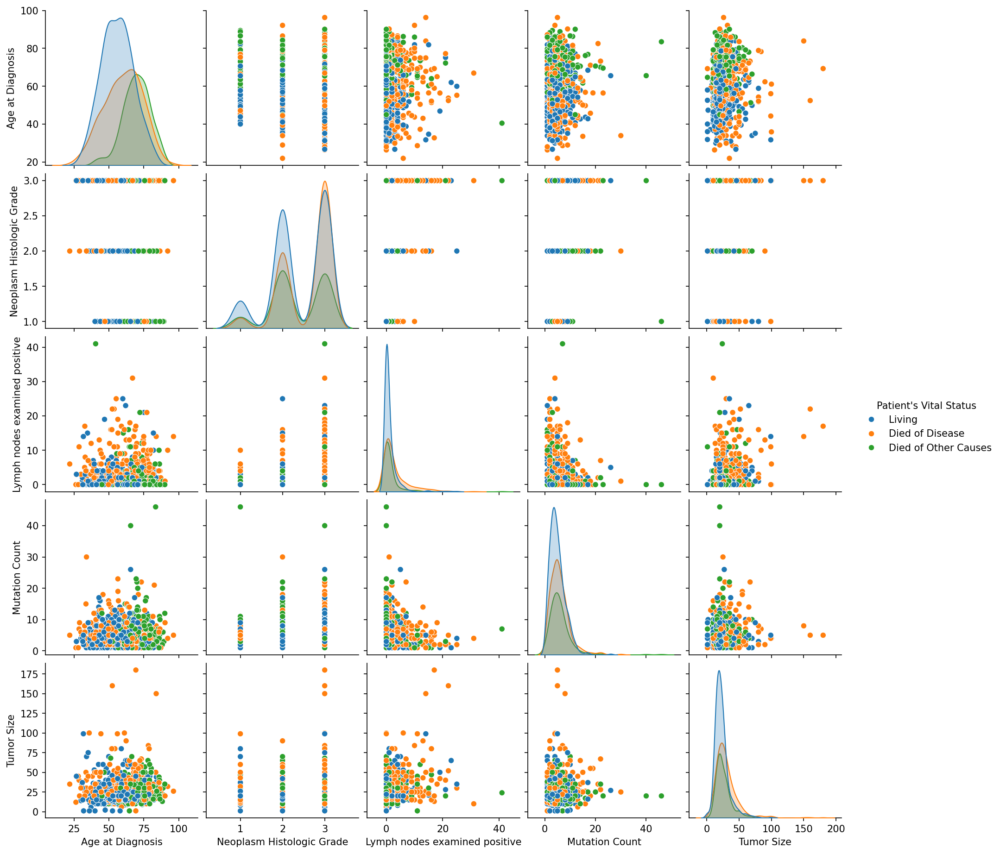
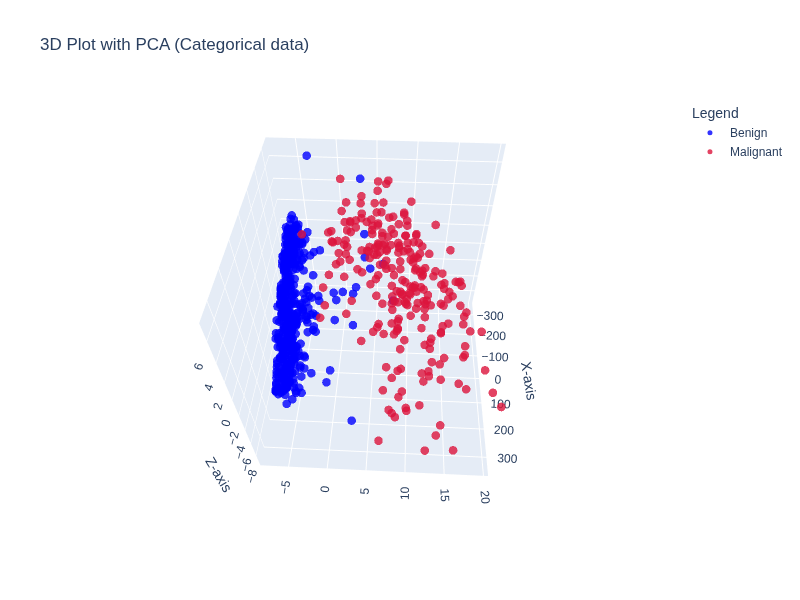
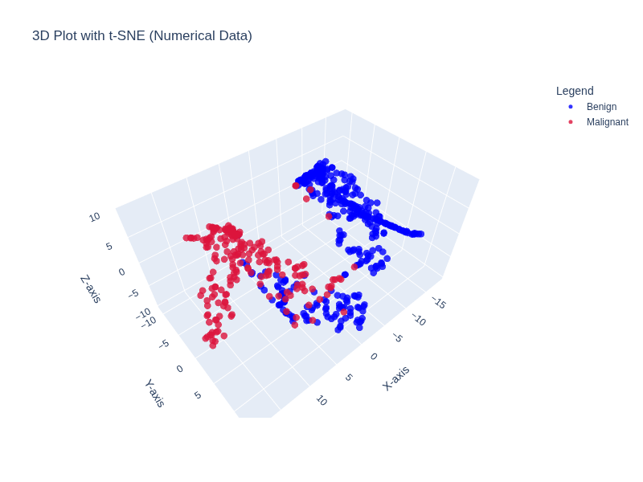

<style>
@page { margin: 6mm; }

html, body {
  margin: 0;
  padding: 0;
}

figure {
  text-align: center;
}

figure img {
  display: block;
  margin: 0 auto;
}

figcaption {
  text-align: center;
}
</style>
<div style="font-size: 10px; line-height: 1.;">

# **Exploratory Analysis of Breast Cancer Datasets**
---
**Author:** Danillo Barros de Souza  
**Email:** danillo.dbs16@gmail.com  
**Project Github:** https://github.com/danillodbs16/Breast_Cancer_Analysis
---

## **Introduction**
Breast cancer is one of the leading causes of mortality among women worldwide. This study aims to identify predictive patterns for early detection and survival prognosis.

This study is based on the investigation of **two main hypotheses:**

* **1.** It is possible to determine whether a tumor is malignant or benign through the analysis of tumor measurements.
* **2.** Patient mortality can be predicted using statistical information from the datasets.

To this end, we will investigate the Breast Cancer Wisconsin and METABRIC datasets to enable the construction of reliable analysis and further predictive models.

### 1. 🧹 **Data Selection and Cleaning**

This section describes the datasets used in the analysis, their structure, origin, and the preprocessing steps applied to ensure data quality, consistency, and usability.

---
## 📊 Dataset 1.1: Breast Cancer Wisconsin (Original – Categorical)

### 📌 Overview

The **Breast Cancer Wisconsin (Original)** dataset contains clinical observations collected by Dr. William H. Wolberg. The data was gathered over time, resulting in natural chronological groupings.

**Total:** 699 samples (as of July 15, 1992)


### 1.1.1 Features Description 🧬

| Feature                      | Categorical Values      |
|-----------------------------|:----------------------:|
| Clump Thickness             | 1 – 10                 |
| Uniformity of Cell Size     | 1 – 10                 |
| Uniformity of Cell Shape    | 1 – 10                 |
| Marginal Adhesion           | 1 – 10                 |
| Single Epithelial Cell Size | 1 – 10                 |
| Bare Nuclei                 | 1 – 10                 |
| Bland Chromatin             | 1 – 10                 |
| Normal Nucleoli             | 1 – 10                 |
| Mitoses                     | 1 – 10                 |
| **Class**                   | **Benign / Malignant** |


## 1.1.2 🌐 Data Sources

- https://www.kaggle.com/datasets/mariolisboa/breast-cancer-wisconsin-original-data-set  
- https://archive.ics.uci.edu/dataset/15/breast+cancer+wisconsin+original  


### 1.1.3 🧹 Data Cleaning

- **Handling Missing Values**
  - The *Bare Nuclei* column contained non-numeric values (e.g., "?")
  - Converted to numeric and handled missing values appropriately

- **Target Variable Standardization**
  - Converted class labels:
    - `2 → Benign`
    - `4 → Malignant`

- **Identifier Issues**
  - The *Sample Code Number* was found to be non-unique
  - Replaced with a reliable index based on the DataFrame

- **Data Type Consistency**
  - Ensured all feature columns are numeric and within expected ranges
---
## 1.2 📊 Dataset 2: Breast Cancer Wisconsin (Diagnostic – Numerical)

### 📌 Overview

This dataset contains features computed from digitized images of Fine Needle Aspirate (FNA) of breast masses. The features describe geometric and statistical properties of cell nuclei.

### 1.2.1 Feature Characteristics 🧬 

| Feature            | Description                                                                 |
|--------------------|:---------------------------------------------------------------------------:|
| Radius             | Mean distance from center to perimeter points                               |
| Texture            | Standard deviation of gray-scale values                                     |
| Perimeter          | Perimeter of the nucleus                                                    |
| Area               | Area of the nucleus                                                         |
| Smoothness         | Local variation in radius lengths                                           |
| Compactness        | (Perimeter² / Area) − 1.0                                                   |
| Concavity          | Severity of concave portions of the contour                                 |
| Concave Points     | Number of concave portions of the contour                                   |
| Symmetry           | Symmetry of the nucleus                                                     |
| Fractal Dimension  | "Coastline approximation" − 1                                               |

Reference:  
K. P. Bennett & O. L. Mangasarian (1992)

### 1.2.2 🌐 Data Source

- https://www.kaggle.com/datasets/uciml/breast-cancer-wisconsin-data  

### 1.2.3 📈 Dataset Summary

- **Total Columns:** 32  
- **Target Variable:** Diagnosis
  - M → Malignant
  - B → Benign  
- **Missing Values:** None detected  
- **Index Column:** ID / Sample code number  


### 1.2.4 🧹 Data Cleaning

- **Removed Irrelevant Columns**
  - Dropped column: `Unnamed: 32` (entirely null)

- **Target Variable Standardization**
  - Converted:
    - `M → Malignant`
    - `B → Benign`

- **Column Naming Consistency**
  - Ensured clear and standardized column names
---
## 1.3 📊 Dataset 3: Breast Cancer Survival (METABRIC)

## 📌 Overview

The METABRIC (Molecular Taxonomy of Breast Cancer International Consortium) dataset contains clinical and genomic data for breast cancer patients, focusing on survival outcomes.

### 1.3.1 🌐 Data Source

- https://www.kaggle.com/datasets/gunesevitan/breast-cancer-metabric  


### 1.3.2 🧬 Dataset Characteristics

- Includes:
  - Clinical variables (age, tumor size, etc.)
  - Gene expression data
  - Survival information

- Suitable for:
  - Survival analysis
  - Risk prediction
  - Advanced statistical modeling


### 1.3.3 🧹 Data Cleaning

- **Missing Value Handling**
  - Identified null values across multiple columns
  - Removed or filtered incomplete records

- **Data Validation**
  - Verified consistency across clinical variables
  - Checked distributions and outliers

## 2. 🗄️ Final Data Integration

After cleaning and preprocessing all datasets:

- All datasets were standardized in terms of:
  - Naming conventions
  - Target labels
  - Data types

- A unified database was created:

```
breast_cancer_analysis.db
```

### 🔗 Integration Steps

- Loaded cleaned datasets into structured tables
- Ensured compatibility across schemas
- Enabled cross-dataset querying and analysis

---

## 3. **Exploratory Data Analysis**

We explore the data base and provided relevant statistics from histograms, bar plots, pair plots and  3D embeddings of dimensionality reduction methods, provided in **Figures 1 - 6**. We used python seaborn, matplotlib as plotly for generating the figures.

Here, we present the statistical results that were relevent in the attempt to distinghish the tumor groups ("**Figures 1** and **2**) and survival status predictability (**Figures 3** and **4**). We also extended the analysis to a comparison with tumor stages, as provided in **Figure 4**. Adicionally, a 3D visualization for both categorical and numerical data is provided in **Figure 5** and **Figure 6**, respectively. 

**Figure 1 and 2** demonstrates that dispite the statistical information had been limited to categorical, there is a high separability between tumor features that reflects into possible tumor classification. Similar results can be found by analysing the **Figures 3 and 4** for the results of numerical data. In contrast, there is no evident of indicators for detencting the survival signs from the METABRIC data, as can be seen in **Figure 3**.  Interestingly, there is some separability between the tumor stage and the statistical features provided, which may induce to a possible object of study of predictability of tumor stage from such features.

Overall, the best group separability remains of detecting tumor diagnosis from the statistical features, as provided in the embeddings in **Figure 5** and **Figure 6**.

<figure>
  
  <figcaption><b>Figure 1:</b> Histograms of categorical breast cancer data.</figcaption>
</figure>

<figure>
  
  <figcaption><b>Figure 2:</b> Pair plots of categorical breast cancer data.</figcaption>
</figure>

<figure>
  
  <figcaption><b>Figure 3:</b> Pair plots of numerical breast cancer data, including p-values of x and y axis, Cohen's d coefficients and centroid distance.</figcaption>
</figure>
<figure>
  
  <figcaption><b>Figure 4:</b> Pair plots of survival breast cancer data. There is no statistical evidence of group separation from the  features provided.</figcaption>
</figure>

<figure>
  
  <figcaption><b>Figure 5:</b> 3D plot of categorical breast cancer data using PCA. </figcaption>
</figure>

<figure>
  
  <figcaption><b>Figure 6:</b> 3D plot of numerical breast cancer data using t-SNE. </figcaption>
</figure>

## 4. **Conclusion**

We investigate three breast cancer datasets: One categorical, one numerical, and one of patient survival status. From our initial hypothesis, we can conclude that:
1. Both categorical and numerical data provided significant intergroup tumor statistical differences from simple measurements (radius, perimeter, concavity, compactness), which are meaningful to distinguish their diagnosis:
2. There is no evidence of correlation between patient survivor status and the provided statistical information, which leads us to conclude that the current information is not enough to define whether a patient will survive.
3. In contrast, there is some statistical evidence that the tumor stages could be associated with the statistical patterns (e.g., age at diagnosis, tumor size, mutation, etc.)

## 5. **Project Difficulties**

1. Writing the report in markdown in a way that it could fit into 10 pages maximum
2. Choosing the correct and most relevant features and statistical results is usually challenging
3. Creation of dashboards in UNIX platforms

## 6. **Future Work**
We are willing to use the current analysis to construct predictive models for tumor classification.n.