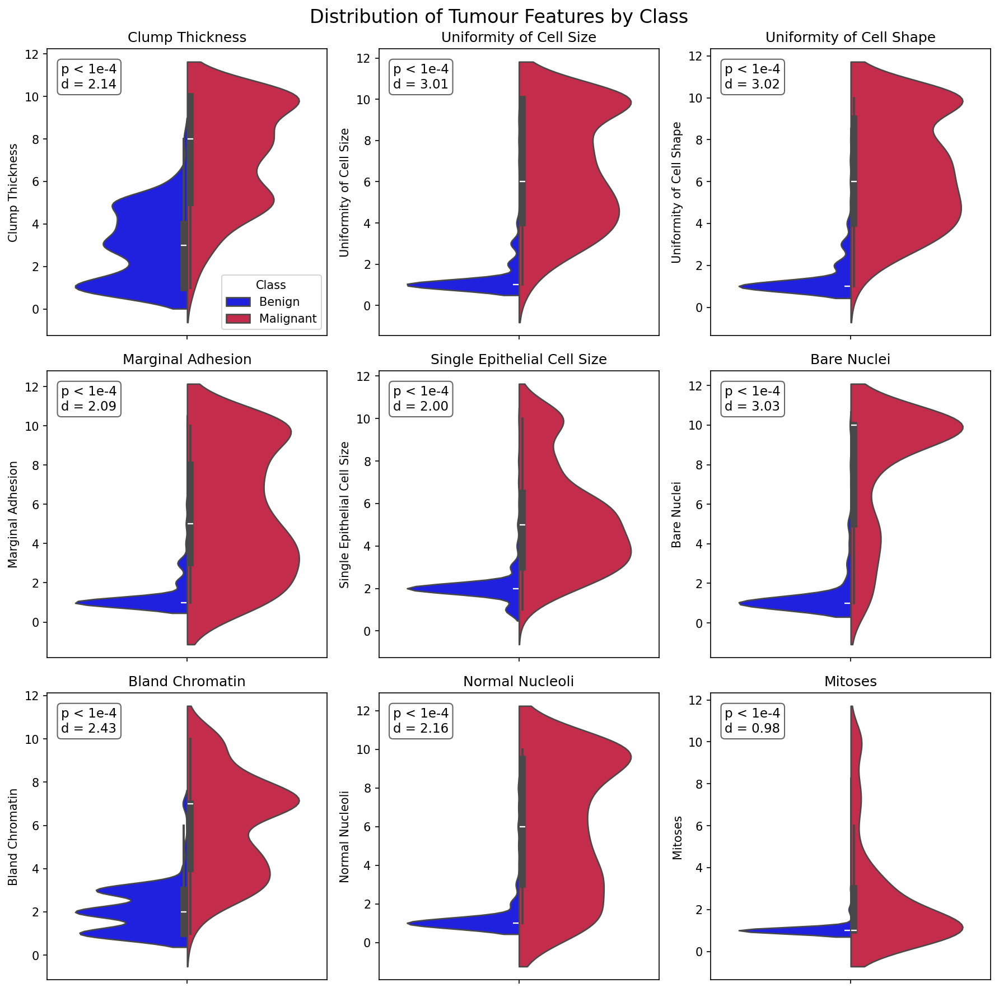

# **Exploratory Analysis of Breast Cancer Datasets**
---
**Author:** Danillo Barros de Souza
**Email:** danillo.dbs16@gmail.com
---
# **Introduction**

# 🧹 **Data Selection and Cleaning**

This section describes the datasets used in the analysis, their structure, origin, and the preprocessing steps applied to ensure data quality, consistency, and usability.

---

# 📊 Dataset 1: Breast Cancer Wisconsin (Original – Categorical)

## 📌 Overview

The **Breast Cancer Wisconsin (Original)** dataset contains clinical observations collected by Dr. William H. Wolberg. The data was gathered over time, resulting in natural chronological groupings.

### 1.1 Data Collection Groups

| Group | Instances | Date |
|------|--------|------|
| Group 1 | 367 | January 1989 |
| Group 2 | 70 | October 1989 |
| Group 3 | 31 | February 1990 |
| Group 4 | 17 | April 1990 |
| Group 5 | 48 | August 1990 |
| Group 6 | 49 | January 1991 (updated) |
| Group 7 | 31 | June 1991 |
| Group 8 | 86 | November 1991 |

**Total:** 699 samples (as of July 15, 1992)

> Note: Group 1 originally contained 369 samples; 2 were later removed.

---

## 1.2 Features Description 🧬

| Feature                      | Categorical Values      |
|-----------------------------|:----------------------:|
| Clump Thickness             | 1 – 10                 |
| Uniformity of Cell Size     | 1 – 10                 |
| Uniformity of Cell Shape    | 1 – 10                 |
| Marginal Adhesion           | 1 – 10                 |
| Single Epithelial Cell Size | 1 – 10                 |
| Bare Nuclei                 | 1 – 10                 |
| Bland Chromatin             | 1 – 10                 |
| Normal Nucleoli             | 1 – 10                 |
| Mitoses                     | 1 – 10                 |
| **Class**                   | **Benign / Malignant** |
---

## 1.3 🌐 Data Sources

- https://www.kaggle.com/datasets/mariolisboa/breast-cancer-wisconsin-original-data-set  
- https://archive.ics.uci.edu/dataset/15/breast+cancer+wisconsin+original  

---

##  1.4 🧹 Data Cleaning

- **Handling Missing Values**
  - The *Bare Nuclei* column contained non-numeric values (e.g., "?")
  - Converted to numeric and handled missing values appropriately

- **Target Variable Standardization**
  - Converted class labels:
    - `2 → Benign`
    - `4 → Malignant`

- **Identifier Issues**
  - The *Sample Code Number* was found to be non-unique
  - Replaced with a reliable index based on the DataFrame

- **Data Type Consistency**
  - Ensured all feature columns are numeric and within expected ranges

---

# 📊 Dataset 2: Breast Cancer Wisconsin (Diagnostic – Numerical)

## 📌 Overview

This dataset contains features computed from digitized images of Fine Needle Aspirate (FNA) of breast masses. The features describe geometric and statistical properties of cell nuclei.

---

## 2.1 Feature Characteristics 🧬 

---
| Feature            | Description                                                                 |
|--------------------|:---------------------------------------------------------------------------:|
| Radius             | Mean distance from center to perimeter points                               |
| Texture            | Standard deviation of gray-scale values                                     |
| Perimeter          | Perimeter of the nucleus                                                    |
| Area               | Area of the nucleus                                                         |
| Smoothness         | Local variation in radius lengths                                           |
| Compactness        | (Perimeter² / Area) − 1.0                                                   |
| Concavity          | Severity of concave portions of the contour                                 |
| Concave Points     | Number of concave portions of the contour                                   |
| Symmetry           | Symmetry of the nucleus                                                     |
| Fractal Dimension  | "Coastline approximation" − 1                                               |
Reference:
K. P. Bennett & O. L. Mangasarian (1992)

---

## 2.2 🌐 Data Source

- https://www.kaggle.com/datasets/uciml/breast-cancer-wisconsin-data  

---

## 2.3 📈 Dataset Summary

- **Total Columns:** 32  
- **Target Variable:** Diagnosis
  - M → Malignant
  - B → Benign  
- **Missing Values:** None detected  
- **Index Column:** ID / Sample code number  

---

## 2.4 🧹 Data Cleaning

- **Removed Irrelevant Columns**
  - Dropped column: `Unnamed: 32` (entirely null)

- **Target Variable Standardization**
  - Converted:
    - `M → Malignant`
    - `B → Benign`

- **Column Naming Consistency**
  - Ensured clear and standardized column names

---

# 📊 Dataset 3: Breast Cancer Survival (METABRIC)

## 📌 Overview

The METABRIC (Molecular Taxonomy of Breast Cancer International Consortium) dataset contains clinical and genomic data for breast cancer patients, focusing on survival outcomes.

---

## 3.1 🌐 Data Source

- https://www.kaggle.com/datasets/gunesevitan/breast-cancer-metabric  

---

## 3.2 🧬 Dataset Characteristics

- Includes:
  - Clinical variables (age, tumor size, etc.)
  - Gene expression data
  - Survival information

- Suitable for:
  - Survival analysis
  - Risk prediction
  - Advanced statistical modeling

---

## 3.3 🧹 Data Cleaning

- **Missing Value Handling**
  - Identified null values across multiple columns
  - Removed or filtered incomplete records

- **Data Validation**
  - Verified consistency across clinical variables
  - Checked distributions and outliers

---

# 4. 🗄️ Final Data Integration

After cleaning and preprocessing all datasets:

- All datasets were standardized in terms of:
  - Naming conventions
  - Target labels
  - Data types

- A unified database was created:

```
breast_cancer_analysis.db
```

## 🔗 Integration Steps

- Loaded cleaned datasets into structured tables
- Ensured compatibility across schemas
- Enabled cross-dataset querying and analysis

---

# 5. **Exploratory Data Analysis**

<figure>
  
  <figcaption><b>Figure 1:</b> KDE plot of categorical breast cancer data</figcaption>
</figure>


<figure>
  
  <figcaption><b>Figure 2:</b> Histograms of categorical breast cancer data</figcaption>
</figure>


<figure>
  
  <figcaption><b>Figure 3:</b> Pair plots of categorical breast cancer data</figcaption>
</figure>
